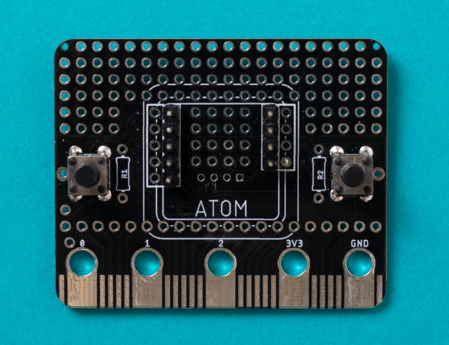
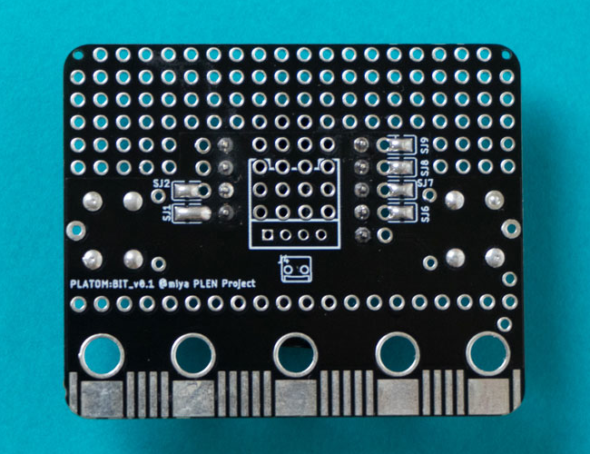

# M5 Atom Board for PLEN:bit

Control PLEN:bit with M5 Atom.

PLEN:bitをM5ATOMでコントロール。
PLEN:bitにM5ATOMを取り付け可能にするために変換基板を使用します。

## PLEN:bit用M5ATOM変換基板について

micro:bit型の変換基板にM5ATOMを取り付けでき、それをmicro:bitの代わりにPLEN:bitへ取り付けることで、M5ATOMから制御できるようになります。

PLEN:bit用の基板ですがピンの接続先の変更が可能であり、ユニバーサール基板のようにスルーホールも設けているため、M5ATOMをmicro:bit型変換基板として使え、micro:bit用のアクセサリーを制御することにも使用できます。

## Examples サンプルコードについて

- /examples
    - PLENAtom M5AtomでPLEN:bitを動かす
    - PLENAtom_FLed M5AtomのLEDをフルカラーで点灯
    - PLENAtomENV 環境センサとの組み合わせ

### プログラム環境
- ArduinoIDE
### 必要なライブラリ
- M5Atom
- PLEN5Stack

## Soldering reference 基板のはんだ付けについて
### 図1を参考にヘッダーピンはんだ付けする
- ヘッダーピンは4ピンと5ピンにニッパーなどの工具を使って切り分ける
- 位置に注意してヘッダーピンをはんだ付けする
- 必要に応じてタクトスイッチをはんだ付け
- タクトスイッチ横にプルアップ抵抗用のスルーホールも用意していますので必要に応じてご使用ください。

<figcaption>図1. 基板表</figcaption>

### 図2を参考に基板裏面のPADをはんだ付けする
- PADのSJ1,SJ2,SJ6,SJ7,SJ8,SJ9をはんだ付けする

### PADのはんだ付けがうまくいかない場合
1. PADをこてで温める
2. はんだを盛る
3. こてを離す
4. はんだを離す

※周りにはんだがつかないようにマスキングテープを張ると作業がしやすくなります。

<figcaption>図2. 基板裏</figcaption>

### PLEN:bit以外に使う方法
- 基板裏面のPAD（SJ1,SJ2,SJ6,SJ7,SJ8,SJ9）のはんだを付けずにPAD横のスルーホールと、micro:bit端子側に並ぶスルーホールを銅線などでつなぐことで、色々な用途にご使用可能です。

### その他
基板裏面真ん中(CN1)にGroveコネクタ向けのスルーホールを設けています。

## About M5 ATOM
https://github.com/m5stack/M5Atom

## Copyright (c) 2020,
- [PLEN Project Company Inc.](https://plen.jp)

## License
This software is released under [the MIT License](http://opensource.org/licenses/mit-license.php).

